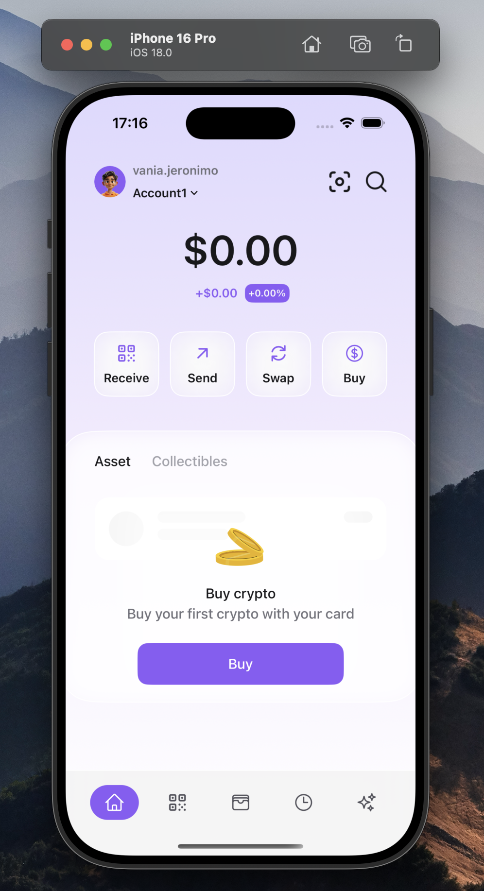

# 🚀 Space Wallet

**Space Wallet** is a crypto wallet app developed as a test project, focusing on design, user experience, and simulation of real-world features — entirely built on the **front-end**.

---

## ✨ About the Project

This project simulates the behavior of a modern cryptocurrency wallet with:

- Fully custom UI designed by a professional designer  
- Polished user experience  
- Mocked services (no real backend)  
- Ideal for testing UI flows, authentication, and asset management logic

> 🔒 **Note:** This is **not a real wallet** and should not be used for actual transactions.

---

## 🛠️ Technologies Used

- SwiftUI (iOS)
- Combine
- Firebase
- SwiftData
- SwiftLint
- Factory
- MVVM-C Architecture
- Mock Services / Mock Data
- Custom UI Components

---

## 📱 Simulated Features

- Account creation and login (mocked)
- Wallet balance and asset overview
- Simulated transactions
- Cryptocurrency listings
- Responsive and animated UI

---

## 📸 Screenshots

### LoginScreen


### HomeScreen




---

## 📦 Local Setup (Xcode)

1. Clone the repository:
   ```bash
   git clone https://github.com/vaniajeronimo/space-wallet.git
